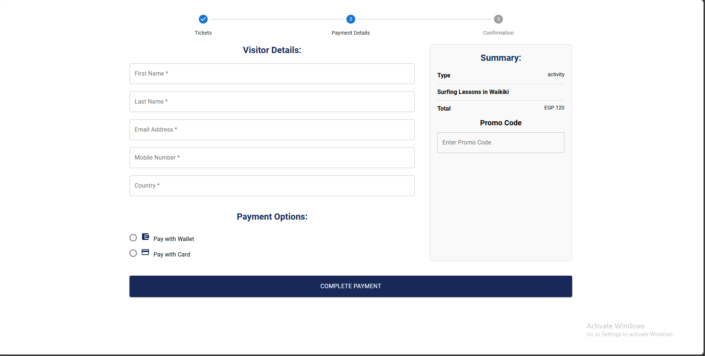

# Beyond-Borders

### About the Project
<p style="font-size: 12px;">
Beyond-Borders is a travel platform designed to simplify vacation planning, offering everything you need to create your perfect trip, from historic landmarks to family-friendly adventures.
</p>

### Motivation
<p style="font-size: 12px;">
The inspiration behind Beyond-Borders stems from a desire to help travelers overcome the hassle of trip planning. We wanted to create a platform that consolidates all essential travel information in one place, making it easier for people to explore the world and discover new experiences without the stress of juggling multiple tools and sources.
</p>

### Build Status

<p style="font-size: 12px;">
The current build of Beyond-Borders is functional but has a few known issues that require attention. These include:
</p>

- **Google Maps API Issue**: The API for Google Maps fails when an advertiser attempts to create an activity. 
- **Slow Fetching of Data**: Fetching data for hotels, flights, and all products can take longer than expected, affecting the user experience.
- **Step-by-Step Tutorial Button**: The open dialog button for the step-by-step tutorial is not immediately obvious to tourists or guests, potentially causing usability challenges.

### Code Style

Our code follows a clean and consistent coding style to ensure maintainability and readability for both backend and frontend code. 

#### Backend Code Style
- **Modular and Reusable Code**: Functions are modular to make them reusable across the application.
- **Clear Comments**: Each function and critical logic segment is well-documented with comments explaining their purpose.
- **Error Handling**: Backend APIs include robust error handling to address edge cases and provide meaningful feedback to users.
- **Consistent Variable Naming**: Variable names are written in `camelCase` to maintain consistency.

### Screenshots
#### Login Page

#### Tourist Home Page

#### Activities Page

#### Events Payment Page



#### Flights API Search

#### Flights API Search Results


### Tech/Framework Used
Below is the list of technologies and frameworks used in the Beyond-Borders project:

- **Node.js**: Used for building the backend server and handling business logic.
- **Express**: A Node.js framework for creating APIs and managing server-side routes.
- **React**: Used for developing the frontend and creating interactive user interfaces.
- **Mongoose**: For object data modeling (ODM) and interacting with the MongoDB database.
- **MongoDB Compass**: GUI for querying and managing the MongoDB database.
- **Postman**: For testing APIs during the development process.
- **Git and GitHub**: For version control and project collaboration.

This stack provides a robust and scalable foundation for the Beyond-Borders platform, enabling seamless integration of backend and frontend components.

## Code Snippets

### Backend Implementation: Create Activity

```javascript
const createNewActivity = async (req, res) => {
    const { AdvertiserName, Name, Date, Time, SpecialDiscount, BookingOpen, Price, Location, Category, Tags } = req.body;

    try {
        const existingCategory = await NewActivityCategoryModel.findOne({ NameOfCategory: Category });
        if (!existingCategory) {
            return res.status(400).json({ error: "Selected category does not exist!" });
        }

        const existingTags = await TagsModel.find({ NameOfTags: { $in: Tags } });
        if (existingTags.length !== Tags.length) {
            return res.status(400).json({ error: "One or more tags do not exist!" });
        }

        const newActivity = await ActivityModel.create({
            AdvertiserName, Name, Date, Time, SpecialDiscount, BookingOpen, Price, 
            Rating: 0, Location, Category, Tags, Comments: [], RatingCount: 0
        });

        res.status(200).json({ msg: "New activity is created!", activity: newActivity });
    } catch (error) {
        res.status(400).json({ error: error.message });
    }
};
```
### App.js:
```javascript
app.post("/api/createNewActivity", createNewActivity);
```
### Frontend Implementation:
```javascript
const handleCreateActivitySubmit = async (e) => {
    e.preventDefault();
  
    try {
      const tagsArray = newActivityData.Tags.split(',').map((tag) => tag.trim());
  
      const activityToSubmit = {
        AdvertiserName: localStorage.getItem('username'),
        Name: newActivityData.Name,
        Date: newActivityData.Date,
        Time: newActivityData.Time,
        SpecialDiscount: newActivityData.SpecialDiscount,
        BookingOpen: newActivityData.BookingOpen,
        Price: newActivityData.Price,
        Location: newActivityData.Location,
        Category: newActivityData.Category,
        Tags: tagsArray,
      };
  
      const response = await axios.post('/api/createNewActivity', activityToSubmit);
  
      alert(response.data.msg);
      setIsActivityModalOpen(false);
      fetchActivities(); // Refresh activities after creation
      setNewActivityData({
        Name: '',
        Date: '',
        Time: '',
        SpecialDiscount: '',
        BookingOpen: false,
        Price: '',
        Location: '',
        Category: '',
        Tags: [],
      });
    } catch (error) {
      setActivityErrorMessage(
        error.response?.data?.error || 'An error occurred. Please try again.'
      );
    }
  };

```
```javascript
<Modal open={isActivityModalOpen} onClose={() => setIsActivityModalOpen(false)}>
  <Box
    sx={{
      position: "absolute",
      top: "50%",
      left: "50%",
      transform: "translate(-50%, -50%)",
      width: "90%", // Adjusted for smaller screens
      maxWidth: "600px",
      maxHeight: "90vh", // Limit height to viewport height
      overflowY: "auto", // Enable vertical scrolling
      bgcolor: "background.paper",
      borderRadius: "10px",
      boxShadow: 24,
      p: 4,
    }}
  >
    <Typography variant="h4" align="center" sx={{ marginBottom: "20px" }}>
      Create New Activity
    </Typography>
    <form onSubmit={handleCreateActivitySubmit}>
      <TextField
        fullWidth
        margin="normal"
        label="Activity Name"
        name="Name"
        value={newActivityData.Name}
        onChange={handleActivityInputChange}
        required
      />
      <TextField
        fullWidth
        margin="normal"
        label="Date"
        name="Date"
        type="date"
        value={newActivityData.Date}
        onChange={handleActivityInputChange}
        InputLabelProps={{ shrink: true }}
        required
      />
      <TextField
        fullWidth
        margin="normal"
        label="Time"
        name="Time"
        type="time"
        value={newActivityData.Time}
        onChange={handleActivityInputChange}
        required
      />
      <TextField
        fullWidth
        margin="normal"
        label="Special Discount"
        name="SpecialDiscount"
        value={newActivityData.SpecialDiscount}
        onChange={handleActivityInputChange}
      />
      <FormControlLabel
        control={
          <Switch
            name="BookingOpen"
            checked={newActivityData.BookingOpen}
            onChange={handleActivityInputChange}
          />
        }
        label="Booking Open"
      />
      <TextField
        fullWidth
        margin="normal"
        label="Price (USD)"
        name="Price"
        type="number"
        value={newActivityData.Price}
        onChange={handleActivityInputChange}
        required
      />
      <TextField
        fullWidth
        margin="normal"
        label="Location"
        name="Location"
        value={newActivityData.Location}
        onChange={handleActivityInputChange}
        required
      />
      <TextField
        fullWidth
        margin="normal"
        label="Category"
        name="Category"
        value={newActivityData.Category}
        onChange={handleActivityInputChange}
        required
      />
      <TextField
        fullWidth
        margin="normal"
        label="Tags (comma-separated)"
        name="Tags"
        value={newActivityData.Tags}
        onChange={handleActivityInputChange}
      />
      {activityErrorMessage && (
        <Typography color="error" sx={{ marginBottom: "10px" }}>
          {activityErrorMessage}
        </Typography>
      )}
      <Button
        type="submit"
        variant="contained"
        sx={{
          backgroundColor: "#192959",
          color: "white",
          padding: "10px",
          borderRadius: "4px",
          width: "100%",
          "&:hover": { backgroundColor: "#4b5a86" },
          marginTop: "20px",
        }}
      >
        Create Activity
      </Button>
    </form>
  </Box>
</Modal>
```
## Postman Testing:
To test the `createNewActivity` endpoint using Postman, follow these steps:

1. **Set the HTTP Method**: `POST`
2. **Enter the URL**: http://localhost:8000/api/createNewActivity
3. **Set the Headers**: 
- `Content-Type`: `application/json`
4. **Select the Body Tab**: Choose the **raw** option and set the body type to `JSON`.
5. **Provide the Request Body**:
Example JSON payload:
```json
{
  "AdvertiserName": "yassinotifa5",
  "Name": "Painting Workshop in Paris",
  "Date": "2024-12-20",
  "Time": "14:00",
  "SpecialDiscount": "20%",
  "BookingOpen": true,
  "Price": 80,
  "Location": {
    "type": "Point",
    "coordinates": [2.3428, 48.8867],
    "address": "Montmartre, Paris, France"
  },
  "Category": "Arts and crafts",
  "Tags": ["Cultural", "Romantic", "Historical"]
}
```

### Installation

Follow these steps to set up the project locally:

#### Backend Installation

```bash
# Navigate to the desktop
cd desktop

# Clone the repository
git clone https://github.com/Advanced-computer-lab-2024/Beyond-Borders.git

# Navigate into the project directory
cd Beyond-Borders

# Open the project in Visual Studio Code
code .

# Install backend dependencies
npm install

# Navigate to the source folder
cd src

# Start the backend server
node app
```
#### Frontend Installation

```bash
# Navigate to the frontend folder
cd frontend

# Navigate to the React app folder
cd myapp

# Install frontend dependencies
npm install

# Start the frontend development server
npm start
```
### API References

Below are the APIs used in the Beyond-Borders project:

- **City Codes API**:  
  [https://test.api.amadeus.com/v1/reference-data/locations](https://test.api.amadeus.com/v1/reference-data/locations)

- **Flights API**:  
  [https://test.api.amadeus.com/v2/shopping/flight-offers](https://test.api.amadeus.com/v2/shopping/flight-offers)

- **Hotels by City API**:  
  [https://test.api.amadeus.com/v1/reference-data/locations/hotels/by-city](https://test.api.amadeus.com/v1/reference-data/locations/hotels/by-city)

- **Hotel Offers API**:  
  [https://test.api.amadeus.com/v3/shopping/hotel-offers](https://test.api.amadeus.com/v3/shopping/hotel-offers)

- **Currency Exchange Rates API**:  
  [https://api.exchangerate-api.com/v4/latest/EGP](https://api.exchangerate-api.com/v4/latest/EGP)

   **Stripe API**:  
  Stripe is used for secure payment processing in the Beyond-Borders platform. Below are the keys used for integrating Stripe:
  - **Secret Key**:  
    `sk_test_51QLqHGP7Sjm96OcqEPPQmxSyVbLV9L7Rnj9v67b7lvTT37QGD1aUroGnGnpU4rm8a7CgNrTpNOalXtiXfwofP3pC00FSmMdarL`
  - **Publishable Key**:  
    `pk_test_51QLqHGP7Sjm96OcqAOCQWfQuEwmMBxXj7hieiaUq1Q0m4qd0xaW9xi2GwrQbTb89OHEXUoIyhuAP29EhDlNYXYlC00HnsADGB1`

> **Note**: The secret key should be kept private and used only in server-side code to maintain security. Avoid exposing it in frontend code or public repositories.

### How to Use

Follow these steps to use the Beyond-Borders platform:
#### Guest
1. **Login as a Guest**:
   - On the login page, select the **Continue as Guest** option.
   - You will be redirected to the **Guest Homepage**.

2. **Guest Homepage**:
   - The homepage provides a top bar containing :
     - **Register Now Button**:
       - Click this button to go to the registration page.
       - On the registration page, you can choose to register as one of the following:
         - **Tourist**
         - **Tour Guide**
         - **Advertiser**
         - **Transportation Advertiser**
         - **Seller**

3. **Navigation**:
   - The platform includes a **side navigation bar** with buttons for the following features:
     - **Activities**: Explore upcoming activities available.
     - **Itineraries**: View upcoming itineraries.
     - **Museums**: Discover upcoming museum events and exhibitions.
     - **Historical Places**: Find and view details about upcoming events at historical landmarks.
   - Click on any button to be redirected to the corresponding page for more information.

The guest experience is designed to provide a preview of what the platform offers, while also encouraging registration for a more personalized and feature-rich experience.
#### Tourist

1. **Login**:
   - Use your registered username and password to log in to the platform.
   - If you forgot your password, click the **Forgot Password** button.
   - An OTP will be sent to your registered email. Use it to reset your password.

2. **Tourist Homepage**:
   - After logging in, you will be redirected to the **Tourist Homepage**.
   - The homepage features cards displaying activities, itineraries, and historical places.
   - Click on any card to view more details and access the relevant page.

3. **Navigation**:
   - The platform includes a **side navigation bar** with buttons for the following features:
     - **Flights**: View and book flights.
     - **Hotels**: Browse and reserve accommodations.
     - **Activities**: Explore and book upcoming activities.
     - **Itineraries**: Access upcoming, completed, and saved itineraries.
     - **Museums**: Discover and book museum events.
     - **Historical Places**: Find and book visits to historical landmarks.
     - **Products**: Browse and purchase products.
     - **Transportation**: View and book transportation options.
     - **Complaints**: File complaints or view submitted ones.
     - **Saved Events**: Access events you’ve saved for later.
     - **Orders**: View your product orders.

4. **Top Bar**:
   - The top bar contains the following features:
     - **Profile Button**: View and update your profile details.
     - **Notifications Bell**: Check notifications for updates and alerts.
     - **Cart Icon**: Access your shopping cart to review or update your product selections.
     - **Wishlist Icon**: View and manage your wishlist items.
     - **Logout Button**: Log out of your account.

5. **Bookings and Purchases**:
   - You can view all your current and past bookings, including activities, itineraries, events, flights and hotel reservations.
   - Book events, buy products, and explore various travel options seamlessly on the platform.
#### Admin

1. **Login as Admin**:
   - Enter your admin credentials on the login page.
   - Upon successful login, you will be redirected to the **Admin Statistics/App Revenue Dashboard**.

2. **Top Bar Features**:
   - The top bar provides the following functionalities:
     - **Change My Password**:
       - Click this button to change your current password.
       - A form will appear to enter the current password and the new password.
     - **Manage Access**:
       - Click this button to view a dropdown menu with the following options:
         - **Add Admin**: Add new administrators to the platform.
         - **Add Tourism Governor**: Assign new tourism governors to manage their respective areas.
         - **Requests**: View and manage pending user or event-related requests.
         - **Delete Requests**: Review and delete specific requests or records as needed.
     - **Notifications Bell**:
       - Displays notifications for any out-of-stock products created by the admin.
       - Clicking the bell shows a dropdown list of recent notifications.
     - **Logout**:
       - Allows the admin to securely log out of the platform.

3. **Side Navigation Bar**:
   - The side navigation bar includes the following features for managing platform content:
     - **Complaints**: View and address user complaints or feedback.
     - **Products**: Manage product listings, including adding, editing, or removing products.
     - **Activities**: Oversee and update activities available on the platform.
     - **Itineraries**: Manage itineraries, including creating or editing existing entries.

4. **Admin Interface**:
   - The admin interface is tailored to provide full control and management capabilities, ensuring the smooth operation of the Beyond-Borders platform.
#### Advertiser

1. **Login as Advertiser**:
   - Enter your advertiser credentials on the login page.
   - Upon successful login, you will be redirected to the **Advertiser Statistics and Revenue Dashboard**, where you can view your performance metrics and revenue details.

2. **Top Bar Features**:
   - The top bar includes the following functionalities:
     - **View My Profile**:
       - Click this button to view your profile information, including personal details and account settings.
     - **Notifications Bell**:
       - Displays important notifications related to your activities.
     - **Logout**:
       - Click this button to securely log out of your account.

3. **Side Navigation Bar**:
   - The side navigation bar includes the following feature:
     - **Activities**:
       - View and manage your activities.
       - You can add new activities, update details for existing ones, or remove activities as needed.

4. **Advertiser Interface**:
   - The advertiser interface is designed to provide insights into your performance and tools to manage your activities efficiently.

---

#### Tour Guide

1. **Login as Tour Guide**:
   - Enter your tour guide credentials on the login page.
   - Upon successful login, you will be redirected to the **Tour Guide Statistics and Revenue Dashboard**, where you can view performance metrics and earnings.

2. **Top Bar Features**:
   - The top bar includes the following functionalities:
     - **View My Profile**:
       - Click this button to view your profile information, including personal details and account settings.
     - **Notifications Bell**:
       - Displays important notifications related to your itineraries or feedback from tourists.
     - **Logout**:
       - Click this button to securely log out of your account.

3. **Side Navigation Bar**:
   - The side navigation bar includes the following feature:
     - **Itineraries**:
       - View and manage your itineraries.
       - You can create new itineraries, update existing ones, or review feedback related to them.

4. **Tour Guide Interface**:
   - The tour guide interface is tailored to provide tools for managing itineraries and insights into your performance.
#### Seller

1. **Login as Seller**:
   - Enter your seller credentials on the login page.
   - Upon successful login, you will be redirected to the **Seller Statistics and Revenue Dashboard**, where you can view performance metrics, revenue, and sales data for your products.

2. **Top Bar Features**:
   - **View My Profile**:
     - Click this button to view your profile information, including personal details, business details, and account settings.
   - **Notifications Bell**:
     - Displays important notifications related to your products, such as low stock or customer feedback.
   - **Logout**:
     - Click this button to securely log out of your account.

3. **Side Navigation Bar**:
   - **Products**:
     - View and manage your product listings.
     - Add new products, update details for existing products (e.g., price, description, and stock availability), or remove products from your catalog.
     - Monitor customer reviews and feedback to improve your offerings.

4. **Seller Interface**:
   - The seller interface is designed to provide all the tools and insights needed to effectively manage your product catalog, enhance customer satisfaction, and boost sales.

---

#### Tourism Governor

1. **Login as Tourism Governor**:
   - Enter your credentials on the login page.
   - Upon successful login, you will be redirected to the **Historical Places and Museums Management Page**, where you can view and manage your listed historical places and museums.

2. **Top Bar Features**:
   - **View My Profile**:
     - Click this button to view your profile details, including your account and responsibilities.
   - **Notifications Bell**:
     - Displays important notifications, such as feedback from visitors or urgent updates for your locations.
   - **Logout**:
     - Click this button to securely log out of your account.

3. **Side Navigation Bar**:
   - **Historical Places**:
     - Manage your listed historical places.
     - Add new locations with details such as descriptions, ticket prices, and opening hours.
     - Update or remove existing listings as needed.
   - **Museums**:
     - View and manage museums under your jurisdiction.
     - Add new museum events, update exhibits, and adjust visitor details.

4. **Tourism Governor Interface**:
   - The Tourism Governor dashboard ensures seamless management of historical places and museums while providing tools to enhance visitor experiences and operations.

---

#### Transportation Advertiser

1. **Login as Transportation Advertiser**:
   - Enter your credentials on the login page.
   - Upon successful login, you will be redirected to the **Transportation Management Page**, where you can view and manage your transportation services.

2. **Top Bar Features**:
   - **View My Profile**:
     - Click this button to view your profile details, including account information and service offerings.
   - **Notifications Bell**:
     - Displays important notifications, such as inquiries or updates about your listed transportation services.
   - **Logout**:
     - Click this button to securely log out of your account.

3. **Side Navigation Bar**:
   - **Transportations**:
     - Manage your listed transportation services.
     - Add new transportation options, such as buses, taxis, or private cars.
     - Update or remove existing transportation services.
     - Monitor customer feedback and bookings for better service optimization.

4. **Transportation Advertiser Interface**:
   - The Transportation Advertiser dashboard provides all necessary tools for managing and promoting transportation services effectively, ensuring streamlined operations and enhanced visibility.

### Contribution
We welcome contributions to improve *Beyond-Borders*! Follow these steps:

1.*Fork the Repository*.
2.*Clone Your Fork*:
 ```bash
   git clone https://github.com/your-username/Beyond-Borders.git
 ```
3.*Create a New Branch:*
 ```bash
   git checkout -b feature/your-feature-name
 ```
4.*Make Changes.*
5.*Commit Changes*:
  ```bash
   git commit -m "Add your commit message"
   ```
6.*Push Changes*:
  ```bash
    git push origin feature/your-feature-name
  ```
7.*Submit a Pull Request*

### Contribution Guidelines

- *Ensure clean and modular code*: Write code that is easy to understand and reusable.
- *Test thoroughly before submitting*: Verify that your changes work as intended and do not introduce bugs.
- *Reference any issues your contribution resolves*: Link to the relevant issue(s) in your pull request description.
- *Be respectful and constructive during reviews*: Foster a positive and collaborative environment.

Together, let's build a better *Beyond-Borders*!

### Credits

We would like to acknowledge and thank the following sources of inspiration and resources that helped in building Beyond-Borders:

1. **Talabat**:
   - Inspired us to design the **Products Page**, including features like ratings, shopping cart functionality, and wishlist.

2. **Amazon**:
   - Provided inspiration for implementing an efficient **Products Page**, focusing on user-friendly shopping experiences with comprehensive product details.

3. **TripAdvisor**:
   - Served as a reference for creating the **Homepages** for both tourists and guests, ensuring an intuitive layout and easy navigation to explore activities, itineraries, museums, and historical places.

The ideas and concepts from these platforms guided us in crafting a cohesive and feature-rich experience for our users.

